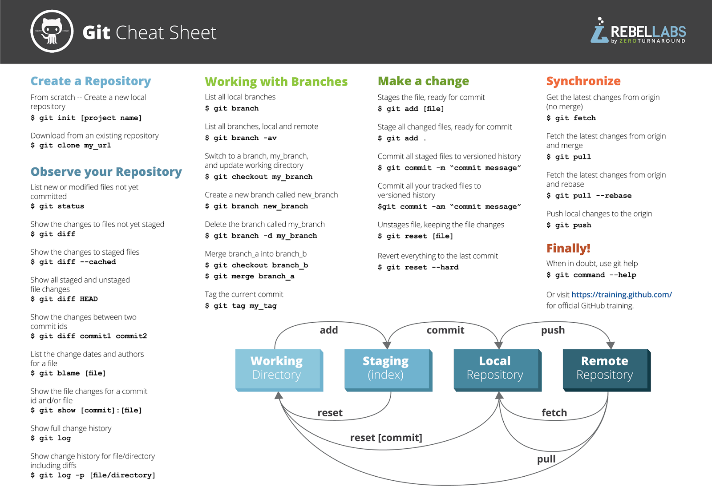

# Git/Versionamento

- [Git/Versionamento](#gitversionamento)
  - [O Que é Git?](#o-que-é-git)
  - [Repositórios Git](#repositórios-git)
  - [Mudanças no Repositório e Status](#mudanças-no-repositório-e-status)
  - [Branches](#branches)
    - [Tipos e Nomeações](#tipos-e-nomeações)
  - [Git Ignore](#git-ignore)
        - [Cheat Sheet](#cheat-sheet)

## O Que é Git?

**Versionamento ↓**

- Registro de mudanças em arquivos; o que possibilita recuperação ou acesso a versões anteriores
- Desenvolvimento de código em colaboração com outros integrantes

O Git é um sistema de versionamento de código, ele guarda os registros de versão como snapshots do estado do projeto, além da referência/caminho para o mesmo.

Boa parte das operações são praticamente instantâneas, isso ocorre devido ao fato de que a maioria das operações feitas pelo Git são locais, o que facilita o acesso aos arquivos, já que todos estão no próprio computador.


O Git pode ser usado direto em linha de comando ou, para aqueles que preferem uma interface mais amigável, é possível utilizar das ferramentas de uma plataforma de hospedagem de código-fonte, como o GitHub e o GitLab, e até dentro do próprio editor de texto ou IDE.

Ao fazer o uso do Git na máquina local pela primeira vez é necessário configurar o ambiente, criando usuário e email.

```bash
git config --global user.name "Username" 

git config --global user.email seuemail@gmail.com
```

## Repositórios Git

Os repositórios podem existir dentro de 2 formas:

- Local, no próprio computador desenvolvedor
- Remoto, na nuvem em uma plataforma de hospedagem

Existem várias formas para ter acesso/fazer o download de um repo remoto para a máquina local. 

Pode ser feita a transferência de arquivos e pastas diretamente, seja pelo download, por pendrive, HD, etc.

Outra forma é o o método HTTPS, o qual usa o Git para transferir o código para a máquina local com a URL do projeto. Também é possível usar uma chave SSH, que nada mais é do que uma credencial de acesso de um protocolo SSH, usado principalmente para automatizar processos e implementar acesso único por administradores de sistemas e usuários avançados.

```bash
C:\Users\PathDoRepoLocal> git clone https://github.com/url-do-projeto.git
```

Para projetos locais começados do zero, é necessário inicializar o  projeto com o comando `git init`. Este comando irá gerar uma pasta `.git` dentro do repositório, dessa forma as alterações e versionamento serão mapeados pelo Git.

```bash
C:\Users\PathDoRepoLocal> git innit
```

## Mudanças no Repositório e Status

**Estados do Git**


Um arquivo dentro do repositório pode apresentar 5 status: 

- **Untracked**
  - Arquivos que não estão sendo monitorados, ou seja, que não foram adicionados no mapeamento do Git.

- **Unmodified**
  - Arquivos que não possuem modificações desde o último mapeamento, arquivos exatamente iguais a `origin/main`.

- **Modified**
  - Arquivos mapeados que foram modificados.

- **Staged** 
  - Guarda os arquivos já preparados para o próximo commit.

- **Commited**
  - Arquivos que já foram comitados para o repositório.

O comando `git status` vai apresentar as informações de como se encontra o repositório e cada estado dos arquivos dentro dele.

```bash
git status
```

O comando `git add` é usado para adicionar os arquivos ao mapeamento ou para o estado de **staged**.

```bash
git add nome-do-arquivo.ext
```

Ou para adicionar todos os arquivos:

```bash
git add --A

git add .
```

Já o comando `git diff` mostra exatamente quais linhas foram modificadas — tanto o que foi removido ou alterando quanto o que foi acrescentado — desde o último commit.

```bash
git diff
```

Para arquivos que já estão no estado **staged**, é necessário adicionar o `--staged` ao final do comando.

```bash
git diff --staged
```

Por fim, o comando `git commit` comita os arquivos para o repositório local. Assim, este arquivo completa um ciclo e passa de **staged** para **unmodified**.

```bash
git commit -m "Comentário"
```

Se for necessário remover algum arquivo, se usa o comando `git rm`.

```bash
git rm nome-do-arquivo.ext
```

Agora, se não é necessariamente a remoção de um arquivo que precisa ser feita, mas sim voltar ao estado **unmodified** para desfazer modificações feitas desde o último commit, se usa o comando `git restore`.

De um arquivo do estado **modified** para o estado **unmodified**:

```bash
git restore nome-do-arquivo.ext
```

De um arquivo do estado **staged** para o estado **modified**:

```bash
git restore --staged nome-do-arquivo.ext
```

`git log` apresenta um histórico de todos os commits que foram feitos no repositório.

**Interações Entre Repo Local e Remoto**

Após o comando commit, as alterações só ficam salvas no repositório local, para que sejam transferidas também para o repositório remoto é necessário usar o comando `git push`.

```bash
git push origin main

git push -u origin main
```

Agora, se há alterações no repositório remoto, a transferência para o local é feita com o comando `git pull`. Isso vai puxar o código remoto e unir com o local, mas este comando não apresenta quais serão as modificações antes de fazer este merge.

Para comparar ambos local e remoto e ver as modificações antes de fazer o pull, pode se usar o comando `git fetch` — para puxar o código — e o `git diff` — para observar as alterações.

```bash
git fetch

git diff origin/main
```


## Branches

As branches são as ramificações do código que podem ser usadas para um desenvolvimento paralelo entre as branches. 

Elas podem ser usadas tanto para controlar melhor o fluxo de desenvolvimento colaborativo, quanto para controlar o fluxo do desenvolvimento individual, tendo a segurança de que se ocorrer alguma erro na branch paralela, a principal estará segura como um checkpoint sem as alterações que ocasionaram o erro.

Quando for necessário — e seguro — essas branches podem ser unidas.


Para criar uma nova branch se usa o comando `git branch`.

```bash
git branch nome-da-branch
```

Para saber em qual branch se está trabalhando existe um ponteiro, chamando Head, que faz este comunicado. Com o comando `git log` as informações tanto sobre o histórico de commits, quanto do ponteiro serão exibidas.

```bash
git log --oneline --decorate
```

O comando `git checkout` é o responsável por fazer a troca entre as branches, da atual para a que se quer trabalhar.

```bash
git checkout nome-da-branch
```

Para fazer a união entre as branches, ou seja, trazer o conteúdo e alterações de uma para a outra, é necessário usar o comando `git merge` quando se está trabalhando na branch que quer unir com outra.

```bash
git checkout nome-da-branch

git merge main
```


### Tipos e Nomeações

As branches se dividem em 2 tipos: regulares e temporárias.

**Regulares**

Essas branches vão estar disponíveis no repositório de forma permanente. Suas convenções de nomes são simples e diretas:

- Development (dev)
  - É a branch principal para o desenvolvimento. 
  - Seu objetivo é restringir para que o desenvolvimento ocorra nela e não na branch main diretamente.
  - Modificações nela devem ser submetidas por reviews e, depois de testes, serem unidas com a branch main.

- Master/Main (master/main)
  - É a branch padrão disponível no repositório Git.
  - Deve estar estável o tempo todo e não permitir qualquer check-in direto.
  - Só pode receber merge depois de um code review.
  - Todos os membros do time são responsáveis por manter a branch estável e atualizada.

- QA (QA)
  - Ou test branch, contêm todos os códigos para testes QA e testes de automação de todas as modificações implementadas.
  - Antes que qualquer mudança passe para o ambiente de produção, deve ser submetida por testes QA para garantir uma base de códigos estável.

**Temporárias**

Estas branches podem ser criadas e deletadas quando for necessário.

- Bug fix
- Hot fix
- Feature
- Experimental
- WIP

Há muitos formatos e convenções de nomes recomendados para branches temporárias, alguns destes são:

**Começar com o Nome do Grupo**

- **BUG**
  - Para um bug que precisa ser concertado.

```bash
git branch bug-logo-alignment-issue
```

- **WIP**
  - Para um trabalho em progresso que não vai terminar tão cedo.

```bash
git branch wip-ioc-container-added 
```

**Usar ID Único**

Também se poder usar o ID de um rastreador de issue. Uma de suas vantagens é a possibilidade de acompanhar o progresso por um sistema externo.

```bash
git bash wip-8712-add-testing-module
```

**Hífen e Underscore**

O uso de hífen e underscore se faz extremamente necessário para se manter a legibilidade dos nomes. Como não se pode usar espaços em branco, é preciso achar outros métodos de separação das palavras ou a sua branch pode acabar assim (impossível de ler):

```bash
git branch featureupgradejqueryversionloginmodule
```

**Com Nome do Autor**

Alguns times e empresas preferem que as branches tenham o nome do autor, de forma que facilite acompanhar o trabalho e progresso de cada desenvolvedor no sistema.

`<author>_<branch-type>_<branch-name>`

```bash
oliwer_feature_new-experimental-changes
```

**Evitar**

- Usar somente números.

```bash
git branch 19753
```

- Usar todas as convenções simultaneamente.

- Nomes longos e muito descritivos.

```bash
git branch wip_login_module_which_will_used_in_the_public_website
git branch wip_login_module_which_will_used_in_the_internal_website
```

## Git Ignore

O Git vê arquivos de 3 formas:

- **Rastreado**
  - Um arquivo que já foi preparado ou confirmado.

- **Não Rastreado**
  - Um arquivo que não foi preparado nem confirmado.

- **Ignorado**
  - Um arquivo que o Git foi forçado a ignorar.

Os arquivos ignorados costumam ser artefatos de desenvolvimento e arquivos gerados por máquina que podem ser derivados da fonte do repositório ou que não devem passar por commit. Exemplos comuns incluem:

- Caches de dependência, como o conteúdo de `/node_modules` ou `/packages`

- Código compilado, como arquivos `.o`, `.pyc` e `.class`

- Diretórios de saída de build, como `/bin`, `/out` ou `/target`

- Arquivos gerados no período de execução, como `.log`, `.lock` ou `.tmp`

- Arquivos de sistema ocultos, como `.DS_Store` ou `Thumbs.db`

- Arquivos pessoais de configuração do IDE, como `.idea/workspace.xml`

Esse mapeamento de arquivos que devem ser ignorados é feito por um arquivo especial chamado `.gitignore` que fica na origem do repositório. Ele é um arquivo que precisa ser editado e fazer o commit de forma manual, não há um comando git ignore explícito.

> Para leitura futura e adicionar anotações posteriormente: 
> https://www.atlassian.com/br/git/tutorials/saving-changes/gitignore
> https://www.freecodecamp.org/portuguese/news/gitignore-explicado-o-que-e-o-gitignore-e-como-adiciona-lo-ao-seu-repositorio/

##### Cheat Sheet



